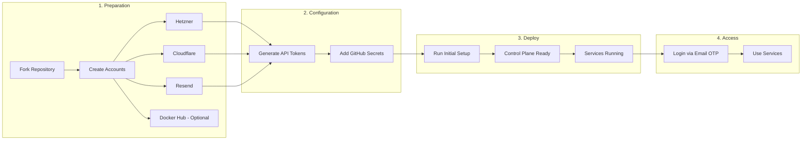
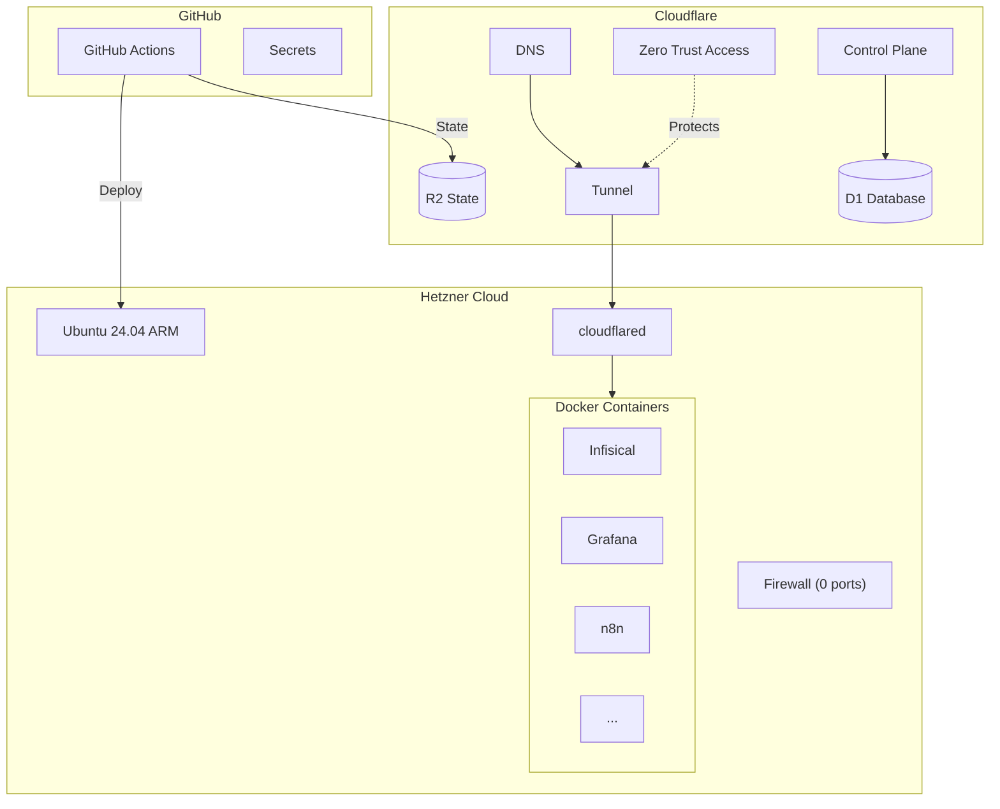
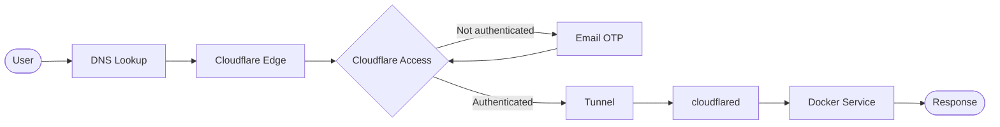

# Nexus-Stack


🚀 **One-command deployment: Hetzner server + Cloudflare Tunnel + Docker - fully automated via GitHub Actions.**

> ⚠️ **Disclaimer:** This project is currently under active development. Use at your own risk. While care has been taken to ensure security, you are responsible for reviewing the code and understanding what it does before running it.

> 📋 **Deployment Method:** This project uses **GitHub Actions exclusively**. Local deployment is not supported as it bypasses the Control Plane architecture.

## What This Does

### Infrastructure
- **Hetzner Cloud Server** - ARM-based (cax11/cax31) running Ubuntu 24.04
- **Cloudflare Tunnel** - All traffic routed through Cloudflare, zero open ports
- **Cloudflare Access** - Email OTP authentication for all services
- **Remote State** - OpenTofu state stored in Cloudflare R2

### Automation
- **Control Plane** - Web UI to manage infrastructure (spin up, teardown, services)
- **GitHub Actions** - Full CI/CD deployment without local tools
- **Scheduled Teardown** - Optional daily auto-shutdown to save costs (with configurable policy to prevent users from disabling it)
- **Email Notifications** - Credentials and status emails via Resend

### Security
- **Zero Entry** - Zero open ports = Zero attack surface
- **Firewall Management** - Open specific TCP ports for external access (Kafka, PostgreSQL, MinIO) via Control Plane, auto-reset on teardown
- **Service Tokens** - Headless SSH access for CI/CD
- **Secrets Management** - Centralized in Infisical with auto-provisioning

### Developer Experience
- **GitHub Actions Only** - No local tools required, fully automated deployment
- **Modular Stacks** - Enable/disable services via Control Plane
- **Auto-Setup** - Admin users created automatically with generated passwords
- **Info Page** - Dashboard with all service URLs and credentials

## Prerequisites

- **[Hetzner Cloud](https://console.hetzner.cloud/) account** - For the server
- **[Cloudflare](https://cloudflare.com) account** - Free tier is sufficient
- **[Resend](https://resend.com) account** - For email notifications (credentials, status updates)
- **A domain** - Must be [added to Cloudflare](https://developers.cloudflare.com/fundamentals/setup/manage-domains/add-site/) (Cloudflare manages DNS)
- **[Docker Hub](https://hub.docker.com) account** *(optional)* - Increases pull rate limits for Docker images

## Getting Started

→ See the **[Setup Guide](docs/setup-guide.md)** for complete installation instructions.

After deployment you'll have:
- `https://control.yourdomain.com` - Control Plane to manage infrastructure
- `https://info.yourdomain.com` - Service dashboard with credentials

### Quick Start Flow



## Available Stacks (49)


| Stack | Description | Website |
|-------|-------------|--------|
| **Adminer** | Lightweight database management tool (supports PostgreSQL, MySQL, SQLite, etc.) | [adminer.org](https://www.adminer.org) |
| **CloudBeaver** | Web-based database management tool | [dbeaver.com/cloudbeaver](https://dbeaver.com/cloudbeaver/) |
| **ClickHouse** | Fast columnar database for real-time analytics and OLAP queries | [clickhouse.com](https://clickhouse.com) |
| **code-server** | VS Code in the browser for remote development | [coder.com](https://coder.com) |
| **Dify** | AI workflow builder for LLM applications, RAG pipelines, and agents | [dify.ai](https://dify.ai) |
| **Draw.io** | Flowchart and diagramming tool for technical diagrams | [diagrams.net](https://www.diagrams.net) |
| **Excalidraw** | Virtual whiteboard for sketching hand-drawn diagrams | [excalidraw.com](https://excalidraw.com) |
| **Filestash** | Web-based file manager with S3/FTP/SFTP/WebDAV backend support | [filestash.app](https://www.filestash.app) |
| **Garage** | Lightweight S3-compatible object storage for self-hosting | [garagehq.deuxfleurs.fr](https://garagehq.deuxfleurs.fr) |
| **Git Proxy** | Public Git HTTPS proxy for external tools (Databricks, Git Desktop) | — |
| **Gitea** | Self-hosted Git service with pull requests, code review, and CI/CD | [gitea.com](https://about.gitea.com) |
| **Grafana** | Full observability stack with Prometheus, Loki & dashboards | [grafana.com](https://grafana.com) |
| **Hoppscotch** | Open-source API testing platform (Postman alternative) | [hoppscotch.io](https://hoppscotch.io) |
| **Info** | Landing page with service overview dashboard | — |
| **Infisical** | Open-source secret management platform | [infisical.com](https://infisical.com) |
| **IT-Tools** | Collection of handy online tools for developers | [it-tools.tech](https://it-tools.tech) |
| **Jupyter** | Interactive PySpark notebook platform with Spark SQL support and cluster connectivity | [jupyter.org](https://jupyter.org) |
| **Kafka-UI** | Modern web UI for Apache Kafka / Redpanda management | [kafka-ui.provectus.io](https://docs.kafka-ui.provectus.io/) |
| **Kestra** | Modern workflow orchestration for data pipelines & automation | [kestra.io](https://kestra.io) |
| **LakeFS** | Git-like version control for data lakes (Hetzner Object Storage backend) | [lakefs.io](https://lakefs.io) |
| **Mage** | Modern data pipeline tool for ETL/ELT workflows | [mage.ai](https://mage.ai) |
| **Mailpit** | Email & SMTP testing tool - catch and inspect emails | [mailpit.axllent.org](https://mailpit.axllent.org) |
| **Marimo** | Reactive Python notebook with SQL support | [marimo.io](https://marimo.io) |
| **Meltano** | Open-source data integration platform (CLI-only, no web UI) | [meltano.com](https://meltano.com) |
| **Metabase** | Open-source business intelligence and analytics tool | [metabase.com](https://www.metabase.com) |
| **MinIO** | S3-compatible object storage for data lakes & backups | [min.io](https://min.io) |
| **n8n** | Workflow automation tool - automate anything | [n8n.io](https://n8n.io) |
| **NocoDB** | Open-source Airtable alternative - turn any database into a spreadsheet | [nocodb.com](https://nocodb.com) |
| **Ollama** | Local LLM inference with Open WebUI chat interface | [openwebui.com](https://openwebui.com) |
| **OpenMetadata** | Open-source metadata management for data discovery and governance | [open-metadata.org](https://open-metadata.org) |
| **pgAdmin** | PostgreSQL administration and development platform | [pgadmin.org](https://www.pgadmin.org) |
| **Portainer** | Docker container management UI | [portainer.io](https://www.portainer.io) |
| **PostgreSQL** | Powerful open-source relational database (internal-only, no web UI) | [postgresql.org](https://www.postgresql.org) |
| **Prefect** | Modern Python-native workflow orchestration for data pipelines | [prefect.io](https://www.prefect.io) |
| **Quickwit** | Cloud-native search engine for log management and analytics | [quickwit.io](https://quickwit.io) |
| **Redpanda** | Kafka-compatible streaming platform with Console UI | [redpanda.com](https://redpanda.com) |
| **Redpanda Connect** | Declarative data streaming framework for real-time pipelines | [redpanda.com](https://redpanda.com) |
| **Redpanda Datagen** | Test data generator for Redpanda topics | [redpanda.com](https://redpanda.com) |
| **RustFS** | Rust-based S3-compatible object storage (MinIO alternative) | [rustfs.com](https://rustfs.com) |
| **S3 Manager** | Web-based S3 bucket browser and manager for Hetzner Object Storage | [GitHub](https://github.com/cloudlena/s3manager) |
| **SeaweedFS** | Distributed object storage with Filer UI and S3 API | [seaweedfs.com](https://seaweedfs.com) |
| **Soda** | Data quality testing with SodaCL checks (CLI-only, no web UI) | [soda.io](https://www.soda.io) |
| **Spark** | Distributed data processing engine (Master + Worker cluster) | [spark.apache.org](https://spark.apache.org) |
| **Trino** | Distributed SQL query engine for querying data across multiple sources | [trino.io](https://trino.io) |
| **Uptime Kuma** | A fancy self-hosted monitoring tool | [uptime.kuma.pet](https://uptime.kuma.pet) |
| **Wetty** | Web-based SSH terminal - access server terminal from any browser | [GitHub](https://github.com/butlerx/wetty) |
| **Wiki.js** | Open-source wiki and knowledge base with Markdown and visual editor | [js.wiki](https://js.wiki) |
| **Windmill** | Open-source workflow engine for scripts, workflows, and UIs | [windmill.dev](https://www.windmill.dev) |
| **Woodpecker CI** | Lightweight Docker-native CI/CD engine with pipeline-as-code | [woodpecker-ci.org](https://woodpecker-ci.org) |

→ See [docs/stacks/README.md](docs/stacks/README.md) for detailed stack documentation and how to add new services.

## Control Plane

Manage your Nexus-Stack infrastructure via web interface at `https://control.YOUR_DOMAIN`.

**Features:**
- ⚡ **Spin Up / Teardown** - Start and stop infrastructure with one click
- 🧩 **Services** - Enable/disable services dynamically
- ⏰ **Scheduled Teardown** - Auto-shutdown to save costs
- 📧 **Email Credentials** - Send login credentials to your inbox

## GitHub Actions Workflows

| Workflow | Description |
|----------|-------------|
| **Initial Setup** | One-time setup (Control Plane + Spin Up). Supports `enabled_services` parameter to pre-select services. |
| **Spin Up** | Re-create infrastructure after teardown |
| **Teardown** | Teardown infrastructure (keeps state) |
| **Destroy All** | Delete everything |
| **Cleanup Orphaned Resources** | Manual cleanup of orphaned Cloudflare resources |

**Pre-select services during Initial Setup:**
```bash
gh workflow run initial-setup.yaml -f enabled_services="grafana,n8n,portainer"
```

→ See [docs/setup-guide.md](docs/setup-guide.md) for configuration details.

## Architecture



## Security

This setup achieves **zero open ports** after deployment:

1. During initial setup, SSH (port 22) is temporarily open
2. OpenTofu installs the Cloudflare Tunnel via SSH
3. After tunnel is running, SSH port is **automatically closed** via Hetzner API
4. All future SSH access goes through Cloudflare Tunnel

**Result:** No attack surface. All traffic flows through Cloudflare.

> **Firewall Management:** For TCP-based services (Kafka, PostgreSQL, MinIO S3 API), the Control Plane provides a Firewall Management page to selectively open ports. DNS A records are created pointing directly to the server IP (`proxied = false`). All firewall rules are automatically reset on every Teardown for security.



- Services are protected by Cloudflare Access (email OTP)
- Set `public = true` in config if you want a service publicly accessible

## Documentation

| Document | Description |
|----------|-------------|
| [Setup Guide](docs/setup-guide.md) | Complete installation and configuration |
| [Control Plane Guide](docs/control-plane.md) | How to use the Control Plane web interface |
| [Stacks](docs/stacks/README.md) | Available services and how to add new ones |
| [Contributing](docs/CONTRIBUTING.md) | How to contribute to the project |

## How It Works

**Read the full story behind Nexus-Stack:**

**[Nexus-Stack: Your Data, Your Rules, Your Flow](https://stefanko-ch.medium.com/nexus-stack-your-data-your-rules-your-flow-46b29abc062d)**

For a detailed technical explanation of how this infrastructure works under the hood - including the Docker deployment on Hetzner and the Cloudflare Zero Trust Tunnel security setup - check out this article:

**[Secure Hetzner Docker Deployment via Cloudflare Zero Trust Tunnel](https://medium.com/@stefanko-ch/secure-hetzner-docker-deployment-via-cloudflare-zero-trust-tunnel-8f716c4631ce)**

## Project Website

Learn more about Nexus-Stack and explore the full documentation:

**[https://nexus-stack.ch/](https://nexus-stack.ch/)**

## License

[MIT](LICENSE)
